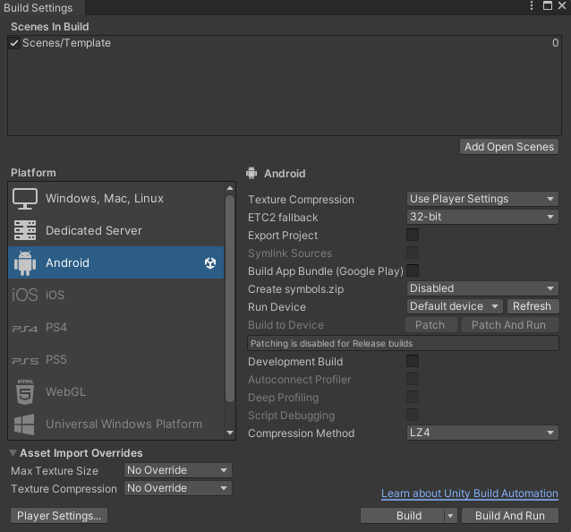
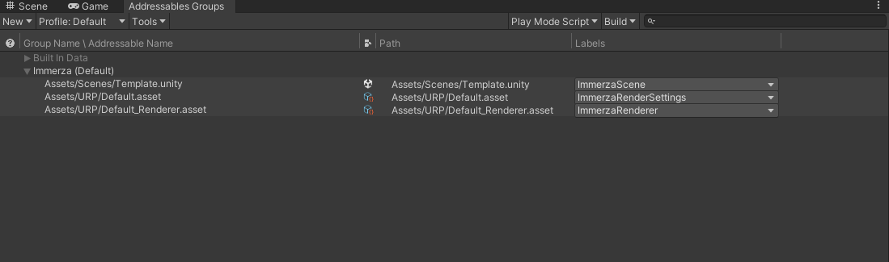

# Immerza Contribution Template

## Opening and intializing the project
Version 2022.3.12f should be used to open and use this template project and all Android related packages should be installed with the editor via the Unity Hub. Also make sure that your Quest device is developer ready: https://developer.oculus.com/documentation/native/android/mobile-device-setup/.
No scene is initially opened when the project is started for the first time, so navigate to the "Scenes" folder, where you can find a scene template. After opening the scene template, the platform should be set to "Android" which can be changed in the Build Settings which are found under the "File"-Tab in the far left corner. 
This is also where you can build an application to test the performance of your scene on real hardware ("Build"-Button). 
**Build Settings**

## Creating a scene and performance
Ensure that your scene performs well on the Quest 2 before trying to export and uploading your work. There are certain scenarios that can heavily impact performance on a mobile VR device like the Quest 2.   
**Things to avoid:**

- reading from the opaque and depth textures Unity provides in their shaders
- bad topology on 3D models
- use of transparency (especially if the blend type is set to be additive)
- lots of data transfers between the CPU and the GPU (GPU instancing is really helpful here to reduce draw calls)
- use of the Unity terrain system (replacement example can be found under "Shaders" -> "Examples")

Also make sure that the assets used are either have a CC0 license or created by you or your team to avoid licensing issues. The spline "PlayerPath" in the template scene is using the Unity spline system to trace out the path the player will take when users start the scene: https://docs.unity3d.com/Packages/com.unity.splines@1.0/manual/getting-started-with-splines.html.

## Exporting the scene
Open the "Addressables Groups" tab which can be found in:   **"Window" -> "Asset Management" -> "Addressables" -> "Groups"**

Make sure that the scene and the render settings are registered and have their corresponding tags. If you have a custom scene file and/or settings the entries should be changed accordingly:

To bundle the scene into the files required for uploading it to the contributor website, go to "Build" -> "New Build" -> "Default Build Script". When asked if the new Addressables Debugger View should be used it is recommended to enable it. After the scene is built the files will be accessible from the "ServerData/Android" folder.

The files can be uploaded in the contributor portal after creating an account and signing in: https://contributor.immerza.com/.